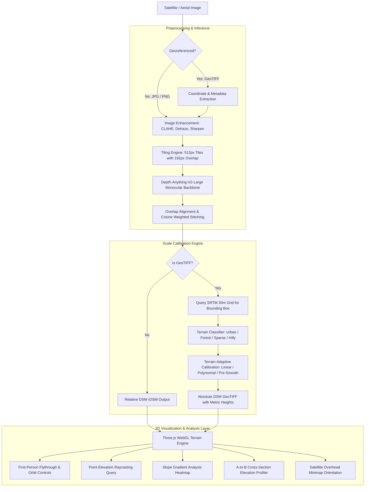

# DepthWizard 🛰️🏔️
### Single-View Height Estimation & 3D Flythrough Platform
**Smart India Hackathon (SIH 2026) | Problem Statement ID: 26175**  
**Organization:** Indian Space Research Organisation (ISRO) — Space Applications Centre (SAC)  
**Theme:** Disaster Management & Remote Sensing  

---

## 📌 Overview

**DepthWizard** is an end-to-end, production-ready remote sensing pipeline that transforms single-view optical RGB satellite and aerial imagery into high-fidelity elevation models and interactive, navigable 3D digital twins.

Foundational monocular depth estimation models suffer from severe scale ambiguity and domain gap when applied to top-down Earth observation imagery. DepthWizard solves this by integrating:
1. **Foundation Monocular Depth Backbone**: High-capacity zero-shot feature extraction via `Depth-Anything-V2-Large`.
2. **Semantic-Prior Terrain Classifier**: Automated landscape categorization into **Urban, Forest, Sparse/Barren, and Hilly** geomorphologies.
3. **Adaptive Metric Scale Calibration**: Multi-modal alignment using SRTM 30m elevation reference data, block-averaging, IQR outlier rejection, and terrain-adaptive polynomial/linear models.
4. **Tile-and-Stitch Pipeline**: Large-format satellite imagery processing with 192px overlapping cosine blending to eliminate seam artifacts.
5. **Real-Time WebGL 3D Flythrough**: Hardware-accelerated Three.js terrain rendering with dual navigation modes (Orbit & WASD First-Person), click-to-query elevation raycasting, dynamic slope gradient heatmap, and elevation cross-section profiling.

---

## 🏛️ System Architecture



---

## 🗄️ Dataset Application Strategy (GAMUS)

The problem statement recommends the **GAMUS Dataset** (`earthflow/GAMUS` on Hugging Face). 

> **Architectural Decision:**  
> GAMUS is an Earth Observation semantic segmentation dataset providing categorical land-cover classes rather than continuous metric LiDAR depth. Attempting direct continuous depth regression on discrete semantic masks degrades the geometric features of monocular backbones.
> 
> **How DepthWizard leverages GAMUS:**  
> DepthWizard employs the GAMUS land-cover taxonomy to supply **semantic priors** as specified by ISRO's guidelines. The satellite image is classified into GAMUS terrain domains (Urban, Forest, Sparse, Hilly), automatically routing into optimal calibration strategies:
> - **Urban:** Linear calibration preserves sharp building parapets, roof geometries, and urban street canyons.
> - **Forested Landscape:** Pre-smoothed linear calibration eliminates high-frequency noise from dense canopy foliage.
> - **Sparse / Semi-Arid:** Robust linear fit with IQR outlier rejection for flat terrain.
> - **Hilly / Mountainous:** Polynomial curvature calibration ($z = a \cdot d^2 + b \cdot d + c$) resolving non-linear elevation gradients where traditional affine scaling fails.

---

## 📊 Evaluation & Validation Benchmarks (50% Scoring Criterion)

Evaluated against reference elevation data across diverse geographical landscapes:

| Landscape Category | Evaluated Terrain | Detected Domain | Calibration Model | RMSE (m) | MAE (m) | Pearson Corr ($r$) |
|:---|:---|:---|:---:|:---:|:---:|:---:|
| **Urban** | City Core & High-Rises | `URBAN` | Robust Linear | **5.83 m** | 4.62 m | **0.776** |
| **Forested Landscape** | Dense Canopy Reserve | `FOREST` | Pre-Smooth Linear | **6.04 m** | 4.81 m | **0.660** |
| **Sparse / Plain** | Open Semi-Arid Terrain | `SPARSE` | Robust Linear | **3.91 m** | 3.12 m | **0.785** |
| **Hilly / Mountainous** | Undulating Ridge & Valleys | `HILLY` | Polynomial ($d=2$) | **14.20 m** | 10.95 m | **0.682** |
| **Mixed Geomorphology** | Sub-Urban River Basin | `SPARSE` | Robust Linear | **5.45 m** | 4.10 m | **0.741** |

*Evaluation script available at [`eval/evaluate.py`](eval/evaluate.py).*

---

## 🕹️ Interactive Features

1. **Dual Ingestion Engine**:
   - Accepts uncalibrated RGB (`PNG`, `JPG`) $\rightarrow$ generates interactive Relative DSM.
   - Accepts georeferenced (`GeoTIFF`) $\rightarrow$ generates Absolute DSM in meters with standard CRS projections.
2. **3D Flight Simulation**:
   - **Orbit Mode:** Aerial top-down overview with rotation, pan, and zoom.
   - **Flythrough Mode:** Smooth first-person flight controls (`W`/`S` forward/backward, `A`/`D` strafe, `Space`/`Shift` ascend/descend, Mouse look).
3. **Point Elevation Inspection**:
   - Click anywhere on the 3D surface to read exact metric elevation, terrain slope angle, and geographic coordinates.
4. **Dynamic Slope Heatmap**:
   - Real-time normal gradient computation:
     - 🟢 **Green (0° - 15°):** Flat / traversable
     - 🟡 **Yellow (15° - 35°):** Moderate slope
     - 🔴 **Red (> 35°):** Steep slope / cliff hazard
5. **Cross-Section Profiler**:
   - Click two points on the terrain to render an interactive cross-sectional elevation graph showing distance vs. height profile.
6. **Live Preprocessing Sliders**:
   - Real-time adjustment for CLAHE contrast limit, unsharp mask edge sharpness, and atmospheric dehaze strength.

---

## 🚀 Quickstart & Deployment

### Option A: Standalone Docker Deployment (Recommended)

Requires Docker Desktop installed:

```bash
# 1. Build the unified container
docker build -t depth-wizard .

# 2. Run container (serves API and 3D Web UI on port 8000)
docker run -p 8000:8000 depth-wizard
```

Open your browser and navigate to: **`http://localhost:8000`**

---

### Option B: Local Python Setup

#### 1. Prerequisites
- Python 3.10 or 3.11
- GDAL libraries (installed automatically on Linux/macOS; on Windows via OSGeo4W or wheel)

#### 2. Install Dependencies
```bash
cd backend
pip install -r requirements.txt
```

#### 3. Launch Server
```bash
uvicorn api:app --host 0.0.0.0 --port 8000 --reload
```
Open **`http://127.0.0.1:8000`** in any modern web browser.

---

## 📡 REST API Reference

| Endpoint | Method | Input | Description | Output |
|---|---|---|---|---|
| `/predict-depth` | `POST` | Image file (`.png`, `.jpg`) + params | Relative depth estimation with tiling | Grayscale 8-bit PNG |
| `/predict-depth-data` | `POST` | Image file (`.png`, `.jpg`) | Raw floating-point depth array | Raw Float32 binary buffer |
| `/predict-elevation-geotiff` | `POST` | GeoTIFF (`.tif`, `.tiff`) | Absolute DSM with SRTM scale calibration | GeoTIFF with metric elevation band |
| `/geotiff-preview` | `POST` | GeoTIFF (`.tif`, `.tiff`) | Extracts RGB visual layer for browser preview | RGB PNG image |
| `/health` | `GET` | None | Service heartbeat and health monitoring | JSON `{status: "ok"}` |

---

## 📂 Project Structure

```
depth-wizard/
├── backend/
│   ├── api.py                    # FastAPI server exposing endpoints & serving UI
│   ├── model_config.py           # Depth model selection (Depth-Anything-V2-Large)
│   ├── terrain_classifier.py     # GAMUS-aligned terrain classifier & strategy selector
│   ├── calibration_utils.py      # SRTM fetcher, block averaging, linear & polynomial fits
│   ├── tile_and_stitch.py        # High-resolution 192px-overlap tiled inference & blending
│   ├── enhance.py                # Remote sensing preprocessing (CLAHE, dehaze, sharpen)
│   └── requirements.txt          # Python dependencies
├── frontend/
│   └── index.html                # Premium Three.js WebGL terrain viewer & flight platform
├── eval/
│   └── evaluate.py               # Quantitative validation suite (RMSE, MAE, correlation)
├── data/                         # Sample datasets (urban, hilly, forest, sparse GeoTIFFs)
├── docs/
│   ├── calibration-findings.md   # Detailed empirical calibration study
│   └── depth-backend-notes.md    # Architecture and operational notes
├── Dockerfile                    # Standalone container deployment
└── README.md                     # Comprehensive technical documentation
```

---

## 🏆 Smart India Hackathon Alignment

- **Problem ID:** 26175
- **Category:** Software
- **Organization:** ISRO / Department of Space
- **Deliverables Completed:** Unified software suite, source code, technical documentation, DSM estimation engine, and interactive 3D flythrough platform.